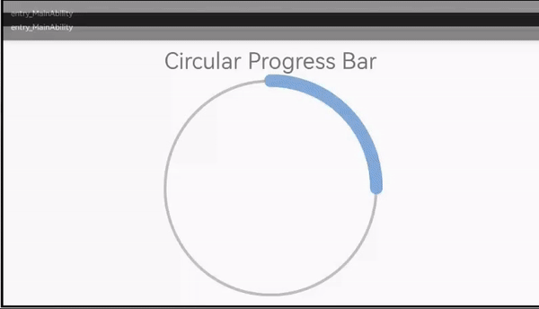

# CircularProgressbar
A HMOS library for Circular progress bar.

## Source
Inspired by [sparrow007/CircularProgressbar](https://github.com/sparrow007/CircularProgressbar) - version V1.0

## Features
1. This library provides an animation similar to circular progress bar.
2. Initially the progress of the circular bar gets completed.
3. The user can click on the bar to get the progress.
4. You can configure the progress bar by using different colors for inner and outer circles.
5. You can configure the width of the progress bar accordingly.
6. You can set the corners of the progress bar to be either rounded or squared.



## Dependency
1. For using circularprogressbar module in sample app, include the source code and add the below dependencies in entry/build.gradle to generate hap/support.har.
```groovy
dependencies {
        implementation project(':circularprogressbar')
        implementation fileTree(dir: 'libs', include: ['*.jar', '*.har'])
        testImplementation 'junit:junit:4.13'
        ohosTestImplementation 'com.huawei.ohos.testkit:runner:1.0.0.100'
}
```
2. For using circularprogressbar in separate application using har file, add the har file in the entry/libs folder and add the dependencies in entry/build.gradle file.
```groovy
dependencies {
	implementation fileTree(dir: 'libs', include: ['*.har'])
	testImplementation 'junit:junit:4.13'
}	
```

## Usage
#### Include following code in your layout:
#### Xml:
```xml
    <com.jackandphantom.circularprogressbar.CircleProgressbar
            ohos:id="$+id:circleprogressbar"
            ohos:width="400vp"
            ohos:height="400vp"
            app:cpb_progress="0"
            app:cpb_roundedCorner="true"
            app:cpb_foregroundProgressWidth="45"
            app:cpb_foregroundProgressColor="#1864c2"
            app:cpb_touchEnabled="true"/>
```
Properties

*   app:cpb_roundedCorner            (boolean)  ->  default false
*   app:cpb_foregroundProgressWidth  (Integer)  ->  default 10
*   app:cpb_backgroundProgressWidth  (Integer)  ->  default 10
*   app:cpb_backgroundProgressColor  (Color)    ->  default ohos.agp.utils.Color.GRAY.getValue()
*   app:cpb_foregroundProgressColor  (Color)    ->  default ohos.agp.utils.Color.BLACK.getValue()
*   app:cpb_progress                 (Float)    ->  default 0
*   app:cpb_touchEnabled             (boolean)  ->  default false
*   app:cpb_clockwise                (boolean)  ->  default false

#### Java:
```java
    CircleProgressbar cpb = (CircleProgressbar) findComponentById(ResourceTable.Id_circleprogressbar);
    cpb.setForegroundProgressColor(Color.RED.getValue());
    cpb.setBackgroundProgressColor(Color.GREEN.getValue());
    cpb.setBackgroundProgressWidth(15);
    cpb.setForegroundProgressWidth(20);
    cpb.enabledTouch(true);
    cpb.setRoundedCorner(true);
    cpb.setClockwise(true);
```

## Future Work
Due to unavailability of similar api as ObjectAnimator in HarmonyOS platform, the following APIs are not supported:

public void setProgressWithAnimation(float progress); <br />
public void setProgressWithAnimation(float progress, int duration);

Once the platform includes ObjectAnimator support, the above APIs can be supported.
                                                                                                   
## Licence
Copyright 2017 Ankit kumar
```
Licensed under the Apache License, Version 2.0 (the "License");
you may not use this file except in compliance with the License.
You may obtain a copy of the License at

    http://www.apache.org/licenses/LICENSE-2.0

Unless required by applicable law or agreed to in writing, software
distributed under the License is distributed on an "AS IS" BASIS,
WITHOUT WARRANTIES OR CONDITIONS OF ANY KIND, either express or implied.
See the License for the specific language governing permissions and
limitations under the License.
```                                                                                   

